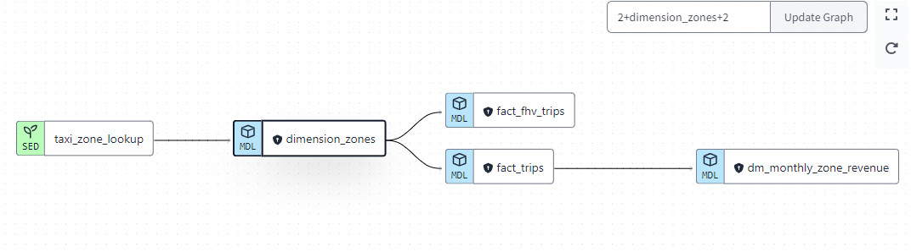

Overall structure of the project is to 
load data into bigquery from gcs, data into gcs using api, and into postgres using using api all this using orhcestration mage 
Then using bigquery dataset and in dbt coverting raw data into transformed data through staging and core processes in development environment then final production environment.Then using the final transformed data and creating dashboards on metabase and looker.

Datasets required are 
- Green taxi data 2019 and 2020
- Yellow taxi data 2019 and 2020
- Fhv data 2019
- taxi zone lookup data

We we will upload the first three datasets into gcs and then from gcs creating tables in bigquery for each of them,
similary we can upload all these datasets into postgres as well

We can use either of the two Bigquery or Postgres as connections and create out staging and final models

We have created
stg_green_taxi_data model
stg_yellow_taxi_data model
stg_fhv_taxi_data model
all these are views
then in core
dimension_zones using taxi zone lookup as seed
fact_trips to join yellow and green staging data and dimension_zones model and  selecting columns
fact_fhv_trips to join staging fhv taxi data model and dimension_zones model and selecting columns
and dm_monthly_zone_revenue model from fact_trips
All these core models are table
You can run each of these using the models using codes

dbt run --select <model name> 
or run all the models at once using 
dbt run
you can run dimension_zones model using
dbt seed as it is being created from seed
We can use  dbt seed --full-refresh to update our dimension_model  to latest refresh

We have created macros_ properties as well
example payment_type_description
we have used dbt utils to use those we have added dependenceies in packages.yml file and also 
run the commant dbt deps to install those

Run dbt debs on the dbt cloud ide terminal to install all dependencies

we have also created various test cases 
which can be run individually 
using 
dbt test command

and to run all the test,models and seeds at once we can use
dbt build

dbt build --select +fact_trips
runs all the models and seeds which are required to run fact_trips


Then we have created a deployment environment 'production' and created jobs to run these models hourly to get updated
we also generated documents while we created the schedules jobs
awesome feature dbt docs generate
'link'

and finally we 
have used these transformed tables created in bigquery to build awesome dashboards to do analytics

we have used looker and metabase
for dashboard creation

Questions I asked for dashboard creation
- Daily,Monthly,Quarterly and Yearly :
    - Total Taxi rides 
    - Total Fare Amount 
    - Top Locations
    - Heatmap for top pickup times
    - Left passengers
    - All theses filtered by service type


# Transforming Taxi Trip Data into Insights

Welcome to our Analytics Engineering project where we leverage the power of dbt to transform raw taxi trip data into actionable insights. In this project, we'll walk you through the process of loading, transforming, and visualizing taxi trip data, culminating in user-friendly dashboards for analysis.

## Data & Tools

### Datasets:
- Green & Yellow Taxi Data (2019-2020)
- FHV Data (2019)
- Taxi Zone Lookup

### Storage:
- Cloud Storage (GCS) or Postgres (optional)

### Transformation:
- dbt Cloud or dbt Core (local setup)

### Visualization:
- Looker & Metabase

## Project Flow

### Data Loading:
Upload data to GCS or Postgres using orchestration tools (optional).
I have used Mage as the orchestration tool and the pipelines used
are in folder : [API_to_GCS_to_Bigquery](./API_to_GCS_to_Bigquery/).
For detailed implementation of mage you can check my complete etl prjoect on [mage](https://github.com/Ashraf1395/Mage-GCP-Postgres-pipelline).

### Transformation:

1. **Staging Models**: Create views in dbt for initial data cleaning and preparation.
    
    

2. **Core Models**: Build dimension and fact tables in dbt to represent key business metrics.
    
    

### Testing & Documentation:
Ensure data quality and clarity with dbt tests and model documentation.

```bash

    dbt test
    dbt docs generate

```


### Deployment:
Schedule model runs in production environments for continuous updates.

### Visualization:
Build dashboards in Looker & Metabase to explore and analyze the transformed data.

## Key Models & Features

### Dimension table:
- **dimension_zones**: Built from Taxi Zone Lookup data.

    ```bash

    dbt seed --full-refresh
    
    ```
    To refresh the dimension_zones.

    

### Fact tables:
- **fact_trips**: Joins yellow & green taxi data with dimension_zones for comprehensive trip analysis.
    
    ```bash

    dbt run --select fact_trips
    
    ```

    
    

- **fact_fhv_trips**: Analyzes FHV trip data with dimension_zones.

    ```bash
    dbt run --select fact_fhv_trips
    
    ```

   

- **dm_monthly_zone_revenue**: Aggregates monthly revenue by zone from fact_trips.
   
   ```bash
    dbt run --select dm_monthly_zone_revenue
    
    ```

   

### Other Features:
- **Macros & Packages**: Reusable code snippets and dependencies for efficient development.
- **Testing**: dbt tests ensure data quality and model functionality.
- **Documentation**: Clear documentation for each model aids understanding and maintenance.
- **Deployment**: Production environment with scheduled runs for automatic data updates.

## Dashboards

Looker & Metabase dashboards will be built to answer key questions:
- Total Taxi rides
- Total Fare Amount
- Top Locations
- Heatmap for top pickup times
- Left passengers
- All filtered by service type

## Next Steps

1. Implement Looker & Metabase dashboards based on the mentioned questions.
2. Customize and refine dashboards for specific user needs.
3. Explore additional metrics and visualizations for deeper insights.

## Conclusion

This project demonstrates how data transformation and visualization can unlock valuable insights from raw data. By leveraging dbt and other tools, we can empower data-driven decision making and improve business performance.

For detailed instructions on running models and other commands, refer to the following sections:

- **Model Execution**:
  - Run individual models: `dbt run --select <model_name>`
  - Run all models at once: `dbt run`
- **Dimension Zones Model**:
  - Run with seed data: `dbt seed`
  - Update with full refresh: `dbt seed --full-refresh`
- **Dependencies Installation**:
  - Install dependencies: `dbt deps`
- **Testing**:
  - Run tests: `dbt test`
- **Build**:
  - Build all: `dbt build`
  - Build with select model: `dbt build --select +fact_trips`
- **Documentation Generation**:
  - Generate documentation: `dbt docs generate`

For deployment and scheduling, refer to your dbt Cloud environment or set up production environments locally.

Finally, utilize the transformed tables in BigQuery to create insightful dashboards using Looker and Metabase.

Enjoy exploring your data and discovering new insights!
